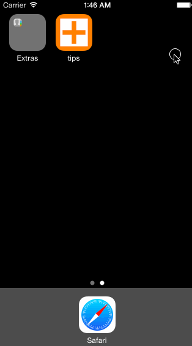

# Tip Calculator

This is an iOS-Swift application for calculation of the tips given the bill amount.

Time spent: about 6 hours spent in total

Completed user stories:

 * [x] Basic: User can input a bill amount, tap anywhere to hide the decimal keyboard, then choose the tip percentage to see the resulting tip and total amount.
 * [x] Settings: User can tap Settings and set default tip percentage and background color. The background color setting is applied immediately and persists after relaunch. The default tip percentage setting is applied after relaunch.
 * [x] Optional: The bill amount and percentage entered by user persist after relaunch for 15 seconds.
 * [x] Optional: The informational view fades in and out depending on whether any amount is entered.
 * [x] Optional: The app has an icon!
 

Walkthrough of all user stories:

GIF created with [LiceCap](http://www.cockos.com/licecap/).